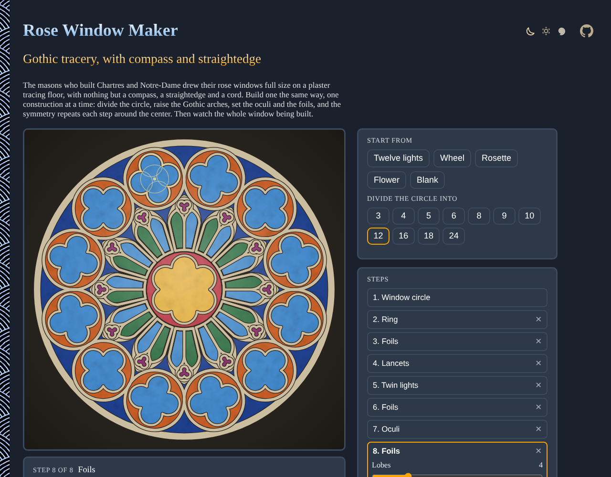

# Rose-Window-Maker

Build a Gothic rose window step by step with compass and straightedge, like a medieval mason: divide the circle, raise equilateral arches, split them into twin lights, set oculi and foils, and the radial symmetry repeats each step around the center. Then watch the whole window being built, and save it as an SVG or a PNG. No sign-up and no libraries.

- [Build a rose window](https://evoluteur.github.io/rose-window-maker/)

## What it does

- **A window is a recipe**, a list of steps a mason could do on the tracing floor:
  - **Window circle**: struck with a cord and divided into 3 to 24 parts.
  - **Ring**: a circle around the center.
  - **Spokes**: radial bars, on or between the divisions.
  - **Lancets**: lights closed by an equilateral (Gothic) arch.
  - **Twin lights**: each lancet split in two smaller arches, with a circle in the head that touches all three.
  - **Oculi**: circles touching each other and an outer circle.
  - **Foils**: trefoils, quatrefoils, cinquefoils... with cusps, set in the circles of the step before.
  - **Petals**: pointed ovals (vesicas) along the axes.
- **Steps**: tune each one, remove it, or add a new one after any step. Five windows to start from: twelve lights, a wheel, a rosette, a flower, or a blank circle.
- **Step by step**: scrub through the recipe, with the mason's instruction for each step and its compass work: the arcs, the lines and the compass points. **Build it** plays the whole construction.
- **Look**: backlit glass or the mason's drawing, four glass palettes (Chartres blue, ruby, grisaille, amber), the weight of the stone bars, and the compass work for the current step, all steps or none.
- **Save**: **Download PNG** (2000 pixels square) or **Download SVG**. The address of the page keeps the window, to share it.

## The geometry

Everything is compass and straightedge, as on the tracing floors of York or Wells:

- **The equilateral arch**: from each springing point, an arc through the other, with the span as radius. Its two halves and its width make an equilateral triangle.
- **Twin lights**: split a light of width 2a in two arches of width a. The big arch and the inner small arch share their center, so the circle that touches all three has radius a/2, and its center is 1.5a from that point: one more stroke of the compass finds it.
- **Oculi**: n circles touching each other and a circle of radius r have radius r·sin(π/n) / (1 + sin(π/n)).
- **Foils**: k circles inside a circle, touching it from inside and cutting each other; the outline is their outer arcs, and the points where they meet are the cusps.

## How it is built

Plain HTML, CSS and JavaScript, with no dependencies and no build step. Just open `index.html`. It is also a small installable web app that works offline.

- The window is one SVG. Each step is drawn once, in the first sector, and repeated around the center. All the code is in [js/rose.js](https://github.com/evoluteur/rose-window-maker/blob/main/js/rose.js).
- The three color themes (dark, light and blue) are shared with my other projects, copied from [omg-themes](https://github.com/evoluteur/omg-themes) (`npm run sync:themes` refreshes them).

Rose-Window-Maker is open source at [GitHub](https://github.com/evoluteur/rose-window-maker) with MIT license.

Had fun browsing the app? [Buy me a coffee by becoming a sponsor](https://github.com/sponsors/evoluteur).

You may also be interested in my other sacred geometry projects [Sacred-Geometry](https://github.com/evoluteur/sacred-geometry) ([demo](https://evoluteur.github.io/sacred-geometry/)), [Mandala-Maker](https://github.com/evoluteur/mandala-maker) ([demo](https://evoluteur.github.io/mandala-maker/)), [Labyrinth-Maker](https://github.com/evoluteur/labyrinth-maker) ([demo](https://evoluteur.github.io/labyrinth-maker/)) and [Celtic-Knot-Maker](https://github.com/evoluteur/celtic-knot-maker) ([demo](https://evoluteur.github.io/celtic-knot-maker/)). For more mystic arts as small web apps, see [Esoterica](https://evoluteur.github.io/esoterica.html).

Copyright (c) 2026 [Olivier Giulieri](https://evoluteur.github.io/).
